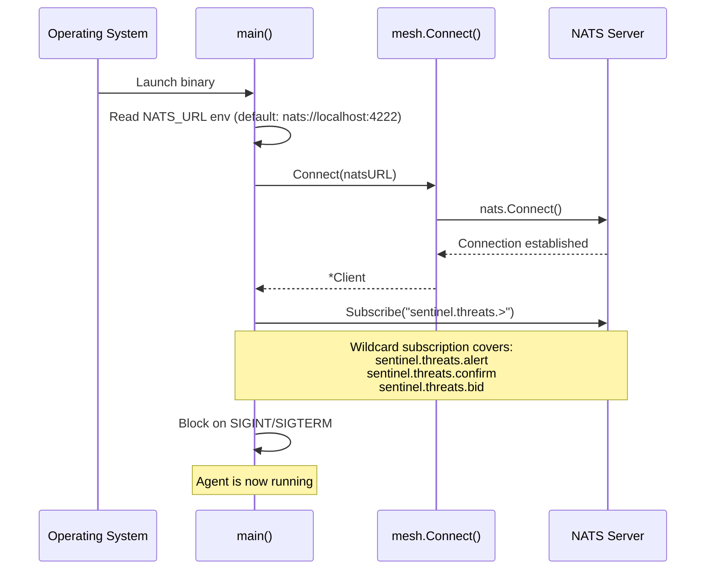
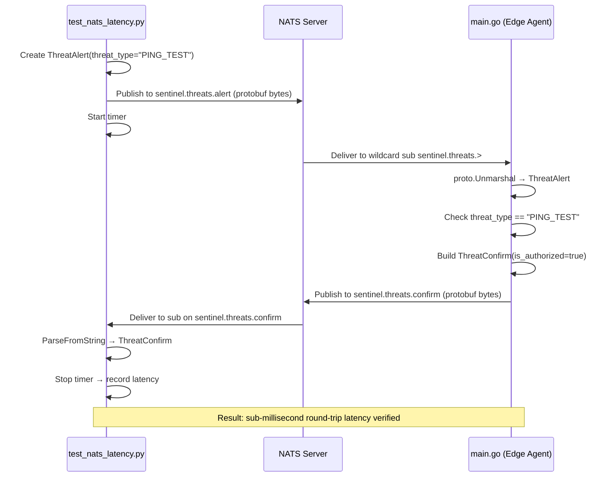

# Edge Agent — Low-Level Design & Codeflow

> **Scope:** Complete technical breakdown of `src/edge-agent/` — every file, every struct, every function, and how data flows between them.

Last Updated: 2026-06-27

---

## 1. High-Level Overview

The Edge Agent is the **nervous system that runs on every drone**. It is a Go binary with a Python sidecar responsibility split:

| Component | Language | Responsibility |
|---|---|---|
| **Go Core** | Go 1.25 | NATS mesh networking, protobuf serialization, TAPP protocol, CBBA task allocation, MAVLink command routing |
| **Python Legacy** | Python | Live state management |

```
┌──────────────────────────────────────────────────┐
│                  DRONE (EDGE NODE)               │
│                                                  │
│  ┌────────────┐    ┌──────────────────────────┐  │
│  │  Python    │    │      Go Edge Agent       │  │
│  │  Sidecar   │    │                          │  │
│  │            │    │  main.go (entry point)    │  │
│  │ live_state │    │         │                │  │
│  │   .py      │    │  ┌──────▼──────┐         │  │
│  │            │    │  │  mesh/      │         │  │
│  │            │    │  │  nats.go    │◄── NATS  │  │
│  │            │    │  │  pb/*.pb.go │   Server │  │
│  │            │    │  └──────┬──────┘         │  │
│  └────────────┘    │         │                │  │
│                    │  ┌──────▼──────┐         │  │
│   Flight          │  │ crdt/       │         │  │
│   Controller ◄────┤  │ cbba/       │ STUBS   │  │
│   (ArduPilot)     │  │ tapp/       │         │  │
│                    │  │ command/    │         │  │
│                    │  └─────────────┘         │  │
│                    └──────────────────────────┘  │
└──────────────────────────────────────────────────┘
```

---

## 2. Directory Structure

```
src/edge-agent/
├── go.mod                              # Module: sentinel-edge-agent (Go 1.25)
├── go.sum                              # Dependency lock file
├── cmd/
│   └── sentinel-agent/
│       ├── main.go                     # ✅ IMPLEMENTED — Entry point
│       └── sentinel-agent              # Compiled binary (11.4 MB)
└── internal/
    ├── mesh/                           # ✅ IMPLEMENTED — NATS networking
    │   ├── nats.go                     #   NATS client wrapper
    │   └── pb/                         #   Auto-generated protobuf Go bindings
    │       ├── threat.pb.go            #     ThreatAlert, ThreatBid, ThreatConfirm
    │       └── fleet.pb.go             #     NodeState, FleetState
    ├── crdt/                           # 🔴 STUB — Distributed state sync
    │   ├── fleet_state.go              #   Empty (0 bytes)
    │   └── live_state.py               #   Python legacy: thread-safe telemetry store
    ├── cbba/                           # 🔴 STUB — Task allocation
    │   ├── engine.go                   #   Empty (0 bytes)
    │   └── scoring.go                  #   Empty (0 bytes)
    ├── tapp/                           # 🔴 STUB — Threat response protocol
    │   └── state_machine.go            #   Empty (0 bytes)
    └── command/                        # 🔴 STUB — FC command routing
        └── command_sender.go           #   Empty (0 bytes)
```

---

## 3. Dependencies

From `go.mod`:

| Dependency | Version | Purpose |
|---|---|---|
| `github.com/nats-io/nats.go` | v1.52.0 | NATS client for mesh pub/sub |
| `google.golang.org/protobuf` | v1.36.11 | Protobuf serialization/deserialization |
| `github.com/klauspost/compress` | v1.18.5 | (indirect) Compression for NATS |
| `github.com/nats-io/nkeys` | v0.4.15 | (indirect) NATS auth keys |
| `golang.org/x/crypto` | v0.49.0 | (indirect) Crypto primitives |

---

## 4. Protobuf Schema (Source of Truth)

The `.proto` IDL files live in `src/protos/`. Go bindings are auto-generated into `internal/mesh/pb/`.

### 4.1 `threat.proto` — TAPP Protocol Messages

**Package:** `sentinel.threats`

| Message | Fields | Purpose |
|---|---|---|
| **ThreatAlert** | `threat_id`, `detector_node_id`, `timestamp`, `threat_type` (string), `confidence` (float), `lat/lon/alt` (double) | A drone has detected a threat. Published to `sentinel.threats.alert`. |
| **ThreatBid** | `threat_id`, `bidder_node_id`, `timestamp`, `bid_score` (float), `proposed_action` (string) | A drone bids to respond to the threat. Published to `sentinel.threats.bid`. |
| **ThreatConfirm** | `threat_id`, `confirmed_by_node_id`, `timestamp`, `is_authorized` (bool) | A drone confirms/denies a threat. Published to `sentinel.threats.confirm`. |

> [!NOTE]
> The current `threat.proto` is **simplified** vs. the full architecture spec. Missing: `ThreatType` enum, `Position`/`Velocity` sub-messages, `ttl` (hop count), `SensorSource` enum, `ThreatReport` message. These are tracked in PLAN.md tasks A6–A8.

### 4.2 `fleet.proto` — CRDT State Messages

**Package:** `sentinel.fleet`

| Message | Fields | Purpose |
|---|---|---|
| **NodeState** | `node_id`, `last_updated`, `lat/lon/alt`, `battery_level`, `status` (string), `vector_clock` (map\<string, uint64\>) | One drone's state snapshot. The `vector_clock` field enables CRDT merge. |
| **FleetState** | `nodes` (map\<string, NodeState\>) | The full fleet's Common Operating Picture (COP). |

---

## 5. File-by-File Deep Dive

---

### 5.1 `cmd/sentinel-agent/main.go` — Entry Point

**Status:** ✅ Fully Implemented  
**Lines:** 66  
**Role:** Boots the Go Edge Agent. Connects to NATS, subscribes to threat topics, and waits for termination.

#### Startup Flow



#### What Happens on Message Receipt

When a message arrives on any `sentinel.threats.*` topic:

1. **Unmarshal** the raw bytes as a `pb.ThreatAlert` protobuf
2. If unmarshal fails (message might be a `ThreatBid` or `ThreatConfirm`), silently skip
3. **Log** the alert: threat type, confidence, and detecting node ID
4. **PING_TEST handler:** If `threat_type == "PING_TEST"`, construct a `pb.ThreatConfirm` with `is_authorized = true` and publish it to `sentinel.threats.confirm`. This is specifically for the latency integration test (`tests/test_nats_latency.py`).

#### Key Design Decisions

- Uses **wildcard subscription** (`sentinel.threats.>`) — subscribes to the entire threat topic tree with a single subscription
- The PING_TEST echo mechanism validates sub-millisecond round-trip latency between Go and Python nodes
- Graceful shutdown via OS signal trapping (`SIGINT`/`SIGTERM`)

---

### 5.2 `internal/mesh/nats.go` — NATS Client Wrapper

**Status:** ✅ Fully Implemented  
**Lines:** 40  
**Role:** Thin wrapper around the `nats.go` library. Provides a clean internal API for the rest of the agent.

#### Struct: `Client`

```go
type Client struct {
    Conn *nats.Conn
}
```

#### Functions

| Function | Signature | What It Does |
|---|---|---|
| `Connect` | `Connect(url string) (*Client, error)` | Dials the NATS server, logs the connected URL, returns wrapped client. |
| `Close` | `(c *Client) Close()` | Nil-safe connection close. |
| `Publish` | `(c *Client) Publish(subject string, data []byte) error` | Publishes raw bytes to a NATS subject. |
| `Subscribe` | `(c *Client) Subscribe(subject string, handler nats.MsgHandler) (*nats.Subscription, error)` | Registers a callback for incoming messages on a subject (supports wildcards). |

> [!TIP]
> This wrapper deliberately exposes raw `[]byte` for data — the caller is responsible for protobuf marshal/unmarshal. This keeps the mesh layer protocol-agnostic.

---

### 5.3 `internal/mesh/pb/threat.pb.go` & `fleet.pb.go` — Protobuf Bindings

**Status:** ✅ Auto-generated  
**Generated by:** `protoc-gen-go v1.36.11` + `protoc v4.25.2`  
**Source:** `src/protos/threat.proto` and `src/protos/fleet.proto`

These files provide Go structs with getter methods, marshal/unmarshal support, and reflection metadata. They are **never edited manually** — regenerate with:

```bash
protoc --go_out=. --go_opt=paths=source_relative src/protos/*.proto
```

---

### 5.4 `internal/crdt/live_state.py` — Thread-Safe State Store (Legacy)

**Status:** ✅ Fully Implemented (Expanded)  
**Role:** In-memory, thread-safe store for live telemetry. This provides the comprehensive drone self-awareness layer for the intelligence sidecar.

#### Internal State Shape

Expanded to include ~40 fields covering IMU, ESC, GPS quality, radio link, etc.

#### Functions

| Function | What It Does |
|---|---|
| `update_telemetry(**kwargs)` | Thread-safe partial update of telemetry fields |
| `update_imu(**kwargs)` | Update IMU/Attitude fields |
| `update_motors(**kwargs)` | Update ESC/motor fields |
| `update_gps_quality(**kwargs)` | Update GPS quality metrics |
| `update_radio(**kwargs)` | Update radio link metrics |
| `update_flight_status(**kwargs)` | Update general flight status |
| `set_connected(connected, error)` | Updates connection status |
| `set_mission_elapsed(seconds)` | Updates mission timer |
| `add_anomaly(anomaly)` | Deduplicates by ID, keeps last 50 |
| `snapshot()` | Returns a deep copy of the full state |
| `reset_anomalies()` | Clears the anomaly list |

> [!IMPORTANT]
> This module is the local state store for a single drone. The Go CRDT implementation (`fleet_state.go`, currently empty) will use this to synchronize distributed, eventually-consistent state across the swarm.

---

## 6. End-to-End Data Flow

### 6.1 Current Working Flow (NATS Latency Test)

This is the only fully wired Go↔Python flow today:



### 6.2 Planned Full Flow (Not Yet Wired)

```
Sensors ──ROS2/MAVLink──► NATS (sentinel.telemetry.*) ──► Python Sidecar (ML Anomaly Detection)
                                                                          │
                                                                          ▼
                                                             sentinel.threats.alert
                                                                          │
                                                               ┌──────────┼──────────┐
                                                               ▼          ▼          ▼
                                                           tapp/     cbba/      Other
                                                         state_     engine.go   Drones
                                                         machine              (mesh)
                                                           .go
                                                               │
                                                               ▼
                                                          command/
                                                         command_sender.go
                                                               │
                                                               ▼
                                                      FC (MAVLink command)
```

---

## 7. Stub Files — What Needs Building

| File | Package | Planned Purpose | PLAN.md Phase |
|---|---|---|---|
| `crdt/fleet_state.go` | `crdt` | CRDT structs + merge logic for distributed COP. Each drone maintains its own `FleetState` and merges with neighbors at 1Hz. | Phase D (D1–D3) |
| `cbba/engine.go` | `cbba` | Consensus-Based Bundle Algorithm. Greedy bundle building, bid gossiping, local conflict resolution. | Phase D (D4, D6) |
| `cbba/scoring.go` | `cbba` | Risk-aware + energy-aware scoring functions. Bid = f(distance, battery, capability). | Phase D (D5) |
| `tapp/state_machine.go` | `tapp` | 4-phase TAPP state machine: Detect→Corroborate→Assess→Execute. Orchestrates the full threat response lifecycle. | Phase E (E1–E4) |
| `command/command_sender.go` | `command` | MAVLink command writer. Sends `SET_MODE`, `MISSION_ITEM_INT` to the FC over serial/UDP after CBBA assigns a task. | Phase E (E5) |

---

## 8. NATS Topic Map

Topics the Edge Agent currently uses or will use:

| Topic | Direction | Message Type | Status |
|---|---|---|---|
| `sentinel.threats.alert` | Subscribe + Publish | `ThreatAlert` (protobuf) | ✅ Active |
| `sentinel.threats.confirm` | Publish | `ThreatConfirm` (protobuf) | ✅ Active (PING_TEST only) |
| `sentinel.threats.bid` | Publish + Subscribe | `ThreatBid` (protobuf) | 🔴 Planned (CBBA) |
| `sentinel.threats.report` | Publish | `ThreatReport` (protobuf) | 🔴 Planned (TAPP Phase 4) |
| `sentinel.fleet.state.{drone_id}` | Publish + Subscribe | `NodeState` (protobuf) | 🔴 Planned (CRDT gossip) |
| `sentinel.mesh.topology` | Publish + Subscribe | TBD | 🔴 Planned |
| `sentinel.telemetry.{drone_id}.position` | Publish | JSON | ✅ Active (from ROS2 bridge) |

---

## 9. Build & Run

```bash
# Build the binary
cd src/edge-agent
go build -o cmd/sentinel-agent/sentinel-agent ./cmd/sentinel-agent/

# Run (requires NATS server on localhost:4222)
./cmd/sentinel-agent/sentinel-agent

# Or with custom NATS URL
NATS_URL=nats://10.0.0.1:4222 ./cmd/sentinel-agent/sentinel-agent

# Run the latency test (from repo root, requires Go agent running)
cd tests
python test_nats_latency.py
```
