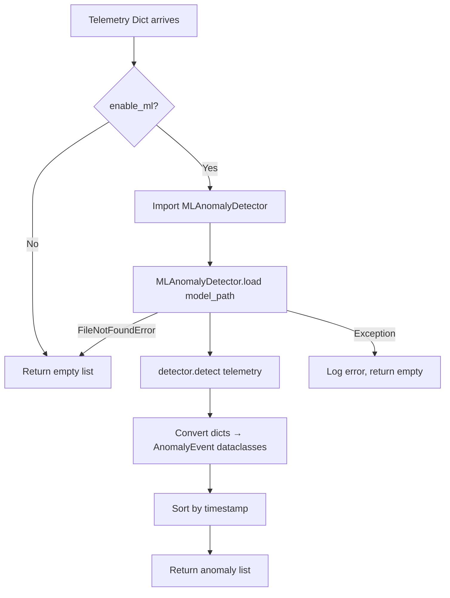
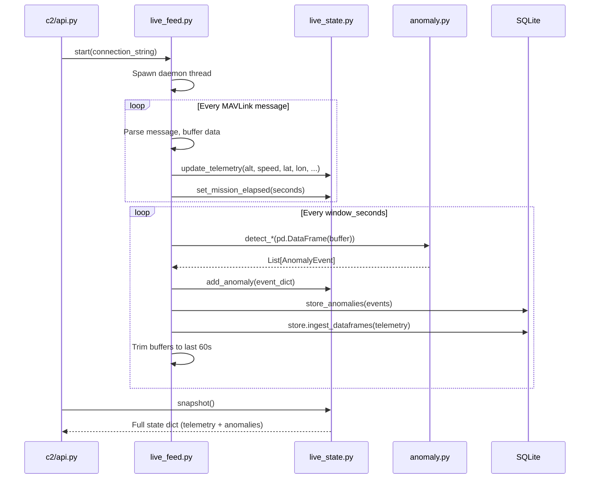

# Intelligence Sidecar — Low-Level Design & Codeflow

> **Scope:** Complete technical breakdown of `src/intelligence/` — every file, every class, every function, and how data flows from raw telemetry to anomaly alerts.

Last Updated: 2026-06-28

---

## 1. High-Level Overview

The Intelligence Sidecar is the **ML brain running on every drone**. It is a pure Python service that subscribes to telemetry data, runs anomaly detection via trained Isolation Forest models, and publishes threat alerts into the NATS mesh.

| Component | Location | Status | Responsibility |
|---|---|---|---|
| **Anomaly Engine** | `domains/anomaly.py` | ✅ Implemented (ML-only) | Orchestrator: loads ML model, dispatches detection, stores results in SQLite |
| **ML Detector** | `ml_models/ml_detector.py` | ✅ Implemented | Isolation Forest training + inference. Feature engineering, scoring, severity classification |
| **Live Feed** | `live_feed.py` | ⚠️ Legacy (Broken imports) | Background MAVLink reader → populates `live_state.py` → runs anomaly scans on a timer |
| **CLI Monitor** | `monitor.py` | ⚠️ Legacy (Broken imports) | Standalone terminal monitor with live anomaly alerting |
| **NATS Sidecar** | `sidecar.py` | 🔴 Empty stub | Planned: NATS subscriber daemon replacing the legacy MAVLink readers |
| **5-Domain Detectors** | `domains/` stubs | 🔴 Planned | Propulsion, Power, Navigation, Flight Dynamics, Electronic Warfare |

```
┌──────────────────────────────────────────────────────────────────────┐
│                  DRONE (EDGE NODE)                                   │
│                                                                      │
│  ┌─────────────────────────────────────────────────────────────┐     │
│  │            Python Intelligence Sidecar                      │     │
│  │                                                             │     │
│  │  ┌──────────────┐   ┌──────────────┐   ┌───────────────┐   │     │
│  │  │  live_feed.py │   │  anomaly.py  │   │  ml_detector  │   │     │
│  │  │  (MAVLink     │──►│ (Orchestrator│──►│  .py          │   │     │
│  │  │   reader)     │   │  ML-only)    │   │ (IsoForest)   │   │     │
│  │  └──────┬────────┘   └──────┬───────┘   └───────────────┘   │     │
│  │         │                   │                                │     │
│  │         ▼                   ▼                                │     │
│  │  ┌──────────────┐   ┌──────────────┐                        │     │
│  │  │ live_state.py │   │ SQLite DB    │                        │     │
│  │  │ (40+ metrics) │   │ (anomalies)  │                        │     │
│  │  └──────────────┘   └──────────────┘                        │     │
│  │                                                             │     │
│  │  ┌──────────────────────────────────────────────────┐       │     │
│  │  │  PLANNED: sidecar.py (NATS-native subscriber)    │       │     │
│  │  │  Replaces live_feed.py + monitor.py              │       │     │
│  │  │  Subscribes to sentinel.telemetry.>              │       │     │
│  │  │  Publishes to sentinel.threats.alert             │       │     │
│  │  └──────────────────────────────────────────────────┘       │     │
│  └─────────────────────────────────────────────────────────────┘     │
│                                                                      │
│  ┌──────────────────────────────┐                                    │
│  │  Go Edge Agent               │◄── Subscribes to threats from NATS │
│  │  (NATS mesh, TAPP, CBBA)     │                                    │
│  └──────────────────────────────┘                                    │
└──────────────────────────────────────────────────────────────────────┘
```

---

## 2. Directory Structure

```
src/intelligence/
├── __init__.py                         # Empty — package marker
├── sidecar.py                          # 🔴 EMPTY STUB — Future NATS daemon
├── live_feed.py                        # ⚠️  LEGACY — Background MAVLink reader (312 lines)
├── monitor.py                          # ⚠️  LEGACY — CLI real-time monitor (201 lines)
├── domains/                            # Anomaly detection domain logic
│   ├── __init__.py                     # Empty — package marker
│   └── anomaly.py                      # ✅ ML-only anomaly orchestrator (98 lines)
└── ml_models/                          # Machine learning models
    ├── __init__.py                     # Empty — package marker
    └── ml_detector.py                  # ✅ Isolation Forest detector (302 lines)
```

### Planned Domain Detectors (Not Yet Created)

| File | Domain | What It Will Do |
|---|---|---|
| `domains/propulsion.py` | Propulsion Health | FFT vibration peak extraction + MCSA motor current analysis |
| `domains/power.py` | Power System | Peukert's law modeling + internal impedance estimation |
| `domains/navigation.py` | Navigation Integrity | EKF innovation gating + GPS/baro altitude cross-check |
| `domains/flight_dynamics.py` | Flight Dynamics | Commanded vs achieved attitude + aerodynamic sysid |
| `domains/electronic_warfare.py` | Electronic Warfare | RF spectrum baselining + fleet link-loss correlation |

---

## 3. Dependencies

| Library | Version | Purpose |
|---|---|---|
| `pandas` | — | Telemetry DataFrames: time-series manipulation, rolling windows |
| `scikit-learn` | — | `IsolationForest` model, `StandardScaler` for feature normalization |
| `numpy` | — | Array ops, percentile calculations, NaN handling |
| `joblib` | — | Model serialization (`.joblib` format for sklearn pipelines) |
| `pymavlink` | — | MAVLink protocol parser (used by legacy `live_feed.py` and `monitor.py`) |

---

## 4. File-by-File Deep Dive

---

### 4.1 `domains/anomaly.py` — ML Anomaly Orchestrator

**Status:** ✅ Fully Implemented (ML-only, post-cleanup)  
**Lines:** 98  
**Role:** The single entry point for running anomaly detection against any telemetry dataset. Delegates all actual detection to the ML model.

#### Dataclass: `AnomalyEvent`

```python
@dataclass
class AnomalyEvent:
    event_type: str       # e.g., "MLAnomaly"
    timestamp: float      # Unix timestamp
    severity: str         # LOW, MEDIUM, HIGH, CRITICAL
    detail: str           # Human-readable description with ML score
    recommendation: str   # Suggested operator action
```

This is the **canonical anomaly type** across the entire SENTINEL system. Every detector (ML, future domain-specific) must produce `AnomalyEvent` instances.

#### Key Functions

| Function | Signature | What It Does |
|---|---|---|
| `run_all_detectors` | `(telemetry, enable_ml=True, model_path=None) → List[AnomalyEvent]` | Loads the trained `MLAnomalyDetector` from disk, runs `.detect()` on the input telemetry, converts raw dicts to `AnomalyEvent` dataclasses, and returns them sorted by timestamp. If `enable_ml=False`, returns empty (no other detection mechanism exists). |
| `store_anomalies` | `(anomalies, drone_id, mission_id, db_path) → int` | Persists detected anomalies into the SQLite database via `TelemetryStore.ingest_anomalies()`. Returns the count of stored rows. |
| `print_anomaly_report` | `(anomalies) → None` | Pretty-prints anomalies to stdout for CLI usage. |

#### Processing Flow



> [!IMPORTANT]
> After the cleanup, this file no longer contains any hardcoded threshold detectors (e.g., `detect_battery_stress`, `detect_idle_drift`). Those functions were removed. This means `live_feed.py` and `monitor.py` have **broken imports** — they still try to import the old functions. See Section 4.4 for details.

---

### 4.2 `ml_models/ml_detector.py` — Isolation Forest Detector

**Status:** ✅ Fully Implemented  
**Lines:** 302  
**Role:** The core ML engine. Trains an Isolation Forest on "normal" flight telemetry and flags statistical outliers during inference.

#### Why Isolation Forest?

| Property | Value |
|---|---|
| **Model type** | Unsupervised (no labeled anomalies needed for training) |
| **Training speed** | < 1 second on typical telemetry logs |
| **Inference speed** | < 1ms per row (real-time capable on edge hardware) |
| **Hardware** | CPU-only, no GPU required |
| **Explainability** | Anomaly scores + top deviating features reported per detection |
| **Reference** | RADD framework (arxiv): hybrid rule+IF achieves >93% detection rate |

#### Feature Engineering Pipeline

The detector doesn't just throw raw telemetry at the model. It builds a rich feature matrix:

**Step 1: Merge telemetry streams** (`_merge_telemetry_streams`)

Takes separate DataFrames (positions, battery, attitude, hud) and aligns them by timestamp using `pd.merge_asof` (nearest-timestamp join). This is needed because sensors report at different rates.

**Step 2: Engineer temporal features** (`_engineer_features`)

For each of the 14 raw features, generates 3 derived features:

| Raw Features (14 total) | Derived Feature | What It Captures |
|---|---|---|
| `relative_alt`, `vx`, `vy`, `vz` (position) | `*_mean` (rolling 10-sample) | Smoothed baseline value |
| `voltage`, `current`, `remaining_pct` (battery) | `*_std` (rolling 10-sample) | Instability / volatility |
| `roll_deg`, `pitch_deg`, `yaw_deg` (attitude) | `*_rate` (first derivative) | Rate of change / trend |
| `airspeed`, `groundspeed`, `climb_rate`, `throttle_pct` (HUD) | | |

**Total feature count:** 14 raw × 4 (raw + mean + std + rate) = **56 features** per time step.

#### Class: `MLAnomalyDetector`

```python
class MLAnomalyDetector:
    model: IsolationForest         # The trained forest
    scaler: StandardScaler         # Zero-mean, unit-variance normalizer
    feature_names: List[str]       # Ordered feature column names
    is_trained: bool               # Guard flag
```

#### Key Methods

| Method | What It Does |
|---|---|
| `train(telemetry)` | Merges streams → engineers features → fits `StandardScaler` → trains `IsolationForest` (100 trees, all CPU cores). Returns training stats dict. |
| `train_from_tlog(filepath)` | Convenience: parses a `.tlog` file via `extract_telemetry_from_file()`, then calls `train()`. |
| `detect(telemetry, percentile_threshold=3.0)` | Merges → engineers → scales → scores via `decision_function()` → flags bottom 3% as anomalies. Computes severity tiers (bottom 1% = CRITICAL, 2% = HIGH, else MEDIUM). Reports top 3 contributing features per anomaly by σ deviation. |
| `save(path)` | Serializes model + scaler + feature names to `.joblib` file. |
| `load(path)` | Class method. Deserializes from `.joblib`. Returns ready-to-use detector. |

#### Detection Severity Logic

```
Anomaly Score Distribution:
━━━━━━━━━━━━━━━━━━━━━━━━━━━━━━━━━━━━━━━━━━━━━━━━
        Normal (97%)       │ MEDIUM │ HIGH │ CRIT
                           │  (1%)  │ (1%) │ (1%)
━━━━━━━━━━━━━━━━━━━━━━━━━━━━━━━━━━━━━━━━━━━━━━━━
                    score_cutoff    p2     p1
                    (3rd pctile)  (2nd)  (1st)
```

For each flagged anomaly, the detector reports:
- The raw anomaly score
- The score cutoff threshold
- The **top 3 most deviating features** with their σ (standard deviation) distance from normal, e.g., `"voltage_rate (4.2σ), climb_rate_std (3.8σ), throttle_pct (3.1σ)"`

---

### 4.3 `monitor.py` — CLI Real-Time Monitor (Legacy)

**Status:** ⚠️ Legacy (Broken imports after anomaly.py cleanup)  
**Lines:** 201  
**Role:** Standalone terminal application that connects directly to an ArduPilot drone via MAVLink, streams telemetry, and runs anomaly detection every N seconds.

#### How It Works

1. Connects to the drone via PyMAVLink (`udpin:127.0.0.1:14551`)
2. Enters infinite `while True` loop reading MAVLink messages
3. Collects 7 message types into rolling in-memory buffers:
   - `GLOBAL_POSITION_INT`, `BATTERY_STATUS`, `ATTITUDE`, `VFR_HUD`, `RADIO_STATUS`, `GPS_RAW_INT`, `ESC_TELEMETRY_1_TO_4`
4. Every 5 seconds, prints a one-line status bar to the terminal
5. Every `window_seconds` (default 10s):
   - Bundles all buffers into a telemetry dict of DataFrames
   - Calls `run_all_detectors(telemetry, enable_ml=True)`
   - Deduplicates alerts by `{event_type}_{timestamp}` key
   - Prints new alerts with severity-colored emoji (🔴 CRITICAL, 🟠 HIGH, 🟡 MEDIUM, 🟢 LOW)
   - Stores anomalies to SQLite via `store_anomalies()`
6. Trims buffers to last 60 seconds to prevent memory growth

#### MAVLink Messages Parsed

| MAVLink Message | Extracted Fields |
|---|---|
| `GLOBAL_POSITION_INT` | lat, lon, relative_alt, vx, vy |
| `BATTERY_STATUS` | voltage, current, remaining_pct |
| `ATTITUDE` | roll_deg, pitch_deg, yaw_deg |
| `VFR_HUD` | airspeed, groundspeed, altitude, climb_rate, throttle_pct |
| `RADIO_STATUS` | rssi |
| `GPS_RAW_INT` | eph |
| `ESC_TELEMETRY_1_TO_4` | rpm[1-4], current[1-4] |

> [!WARNING]
> This file imports `run_all_detectors` from `anomaly` — which exists. But it also implicitly depends on the old per-detector functions removed in the cleanup. Since it calls `run_all_detectors(telemetry, enable_ml=True)`, it still works if a trained model exists. However, if the model is not found, detection silently produces zero results.

---

### 4.4 `live_feed.py` — Background MAVLink Reader (Legacy)

**Status:** ⚠️ Legacy (**BROKEN** — imports non-existent functions)  
**Lines:** 312  
**Role:** The API-facing background worker. Runs in a daemon thread, reads MAVLink telemetry, populates `live_state.py` for the dashboard, and runs per-detector anomaly scans.

#### Why It's Broken

Lines 13-21 import individual detector functions that were **removed** from `anomaly.py`:

```python
from anomaly import (
    detect_attitude_anomaly,      # ❌ REMOVED
    detect_battery_stress,        # ❌ REMOVED
    detect_idle_drift,            # ❌ REMOVED
    detect_signal_degraded,       # ❌ REMOVED
    detect_gps_glitch,            # ❌ REMOVED
    detect_motor_imbalance,       # ❌ REMOVED
    store_anomalies               # ✅ Still exists
)
```

These functions were stripped during the "ML-only" cleanup. `live_feed.py` needs to be refactored to use `run_all_detectors()` instead.

#### How It Works (When Functional)

| Function | What It Does |
|---|---|
| `start(connection_string, window_seconds)` | Spawns a background daemon thread running `_monitor_loop`. Clears old state. Returns `True`. |
| `stop()` | Sets the stop event, joins the thread, marks drone as disconnected. |
| `is_running()` | Returns whether the monitor thread is alive. |
| `_monitor_loop()` | The core loop (identical pattern to `monitor.py`): reads MAVLink → buffers data → updates `live_state` → runs anomaly detection on timer → stores to SQLite → trims buffers to 60s. |

#### Data Flow



#### Key Design Detail: Deduplication

Anomalies are deduplicated using a `{event_type}_{timestamp}` composite key stored in a `set()`. This prevents the same anomaly from being alerted on repeatedly as buffers overlap between scan windows.

---

### 4.5 `sidecar.py` — NATS Subscriber Daemon (Planned)

**Status:** 🔴 Empty stub (0 bytes)  
**Role:** The **production replacement** for both `live_feed.py` and `monitor.py`.

#### Planned Design

Instead of the legacy direct-MAVLink approach, `sidecar.py` will:

1. Subscribe to NATS topics: `sentinel.telemetry.{drone_id}.>` (populated by the ROS2 bridge)
2. Deserialize incoming protobuf/JSON messages
3. Populate `live_state.py` with the full 40+ metric state
4. Run `run_all_detectors()` on sliding windows
5. Publish detected anomalies to NATS: `sentinel.threats.alert` (as `ThreatAlert` protobufs)
6. The Go edge agent subscribes to `sentinel.threats.>` and triggers TAPP/CBBA response

This is the clean separation: **ROS2 collects → NATS transports → Python analyzes → NATS alerts → Go acts**.

---

## 5. End-to-End Data Flow

### 5.1 Current Working Flow (Legacy Pipeline)

This flow powers the existing demo dashboard via `c2/api.py`:

```
ArduPilot FC ──MAVLink──► live_feed.py ──buffer──► anomaly.py ──► MLAnomalyDetector
    │                         │                                         │
    │                         ▼                                         ▼
    │                   live_state.py                              SQLite DB
    │                   (40+ metrics)                           (anomaly rows)
    │                         │                                         │
    │                         ▼                                         ▼
    │                   c2/api.py ◄─────── Dashboard reads from both ──┘
    │                   (REST API)
    ▼
  NATS ◄─── telemetry.py can also publish position data (legacy)
```

### 5.2 Planned Production Flow (NATS-Native)

```
Sensors ──ROS2──► bridge_node.py ──NATS──► sidecar.py ──► anomaly.py ──► MLAnomalyDetector
                                               │                               │
                                               ▼                               ▼
                                         live_state.py                    ThreatAlert
                                         (40+ metrics)                    protobuf
                                               │                               │
                                               │                          NATS publish
                                               │                    sentinel.threats.alert
                                               │                               │
                                               ▼                               ▼
                                          CRDT sync                     Go Edge Agent
                                     sentinel.fleet.state.*         (TAPP + CBBA response)
```

---

## 6. ML Model Lifecycle

### 6.1 Training

```bash
# From repo root — trains on a .tlog file from a nominal mission
python scripts/train_model.py
```

The training script:
1. Parses a `.tlog` file using `extract_telemetry_from_file()`
2. Instantiates `MLAnomalyDetector(contamination='auto', n_estimators=100)`
3. Calls `detector.train(telemetry)` → fits scaler + Isolation Forest
4. Calls `detector.save('data/ml_model.joblib')`

### 6.2 Inference

At runtime, `anomaly.py` calls:
```python
detector = MLAnomalyDetector.load('data/ml_model.joblib')
anomalies = detector.detect(telemetry, percentile_threshold=3.0)
```

### 6.3 Model Artifact

| File | Size | Contents |
|---|---|---|
| `data/ml_model.joblib` | ~50KB typical | Serialized `IsolationForest` + `StandardScaler` + feature name list |

---

## 7. Interaction with Other Services

| Service | How Intelligence Interacts |
|---|---|
| **Edge Agent (Go)** | Planned: Go subscribes to `sentinel.threats.alert` (where sidecar publishes anomalies). Currently no live NATS wiring. |
| **live_state.py (CRDT)** | `live_feed.py` writes telemetry → `c2/api.py` reads snapshots for dashboard. This is the shared state bridge between ingestion and presentation. |
| **C2 (GCS)** | `c2/api.py` imports `live_feed` and `live_state` to power the REST API. `c2/report.py` calls `run_all_detectors()` for post-mission analysis. |
| **SQLite DB** | `store_anomalies()` persists detections. `TelemetryStore` persists raw telemetry. Both are queried by the NLP agent for mission reasoning. |

---

## 8. Known Issues & Migration Path

> [!CAUTION]
> **`live_feed.py` is BROKEN.** It imports 6 detector functions (`detect_battery_stress`, `detect_attitude_anomaly`, etc.) that were removed from `anomaly.py` during the ML-only cleanup. This file will crash on import.

### Fix Options

| Option | Effort | Description |
|---|---|---|
| **A) Patch `live_feed.py`** | Low | Replace the 6 individual detector calls with a single `run_all_detectors(telemetry_dict)` call. Quick fix to restore the demo pipeline. |
| **B) Build `sidecar.py`** | Medium | Implement the NATS-native subscriber. This is the correct long-term solution and makes `live_feed.py` + `monitor.py` obsolete. |
| **C) Both** | Recommended | Patch `live_feed.py` now (keeps demo working), then build `sidecar.py` as the next phase. |

### Legacy File Migration

| Legacy File | Target | Status |
|---|---|---|
| `live_feed.py` | Replaced by `sidecar.py` | ⚠️ Broken, needs patch or replacement |
| `monitor.py` | Replaced by `sidecar.py` | ⚠️ Legacy, still functional if model exists |
| `domains/anomaly.py` | Stays — already in correct location | ✅ Clean |
| `ml_models/ml_detector.py` | Stays — already in correct location | ✅ Clean |
